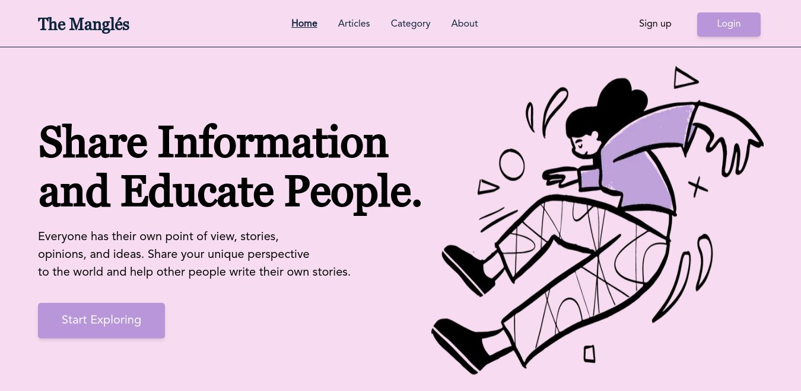
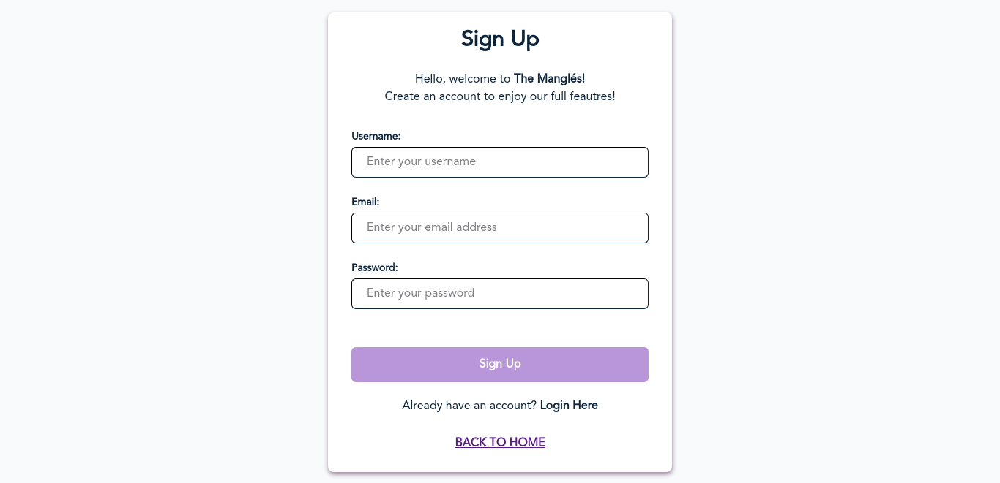
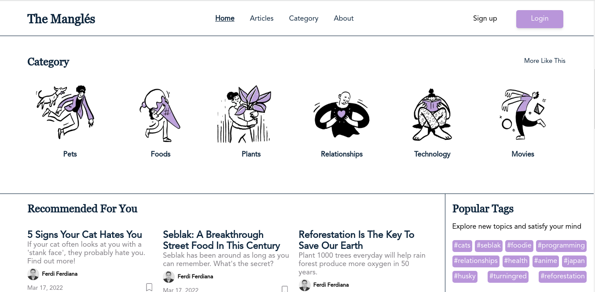
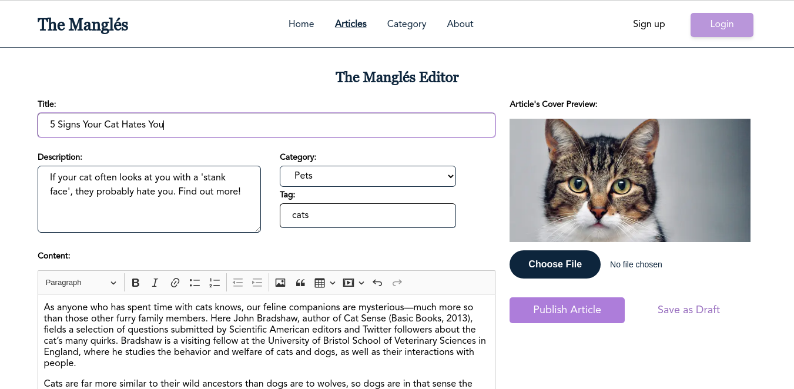
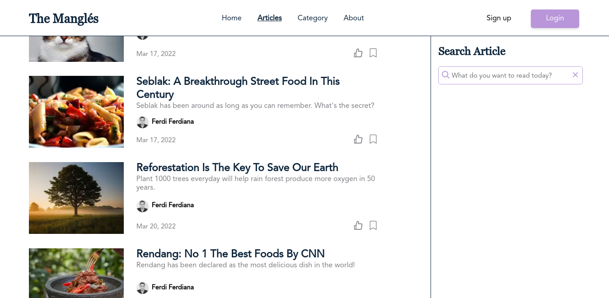
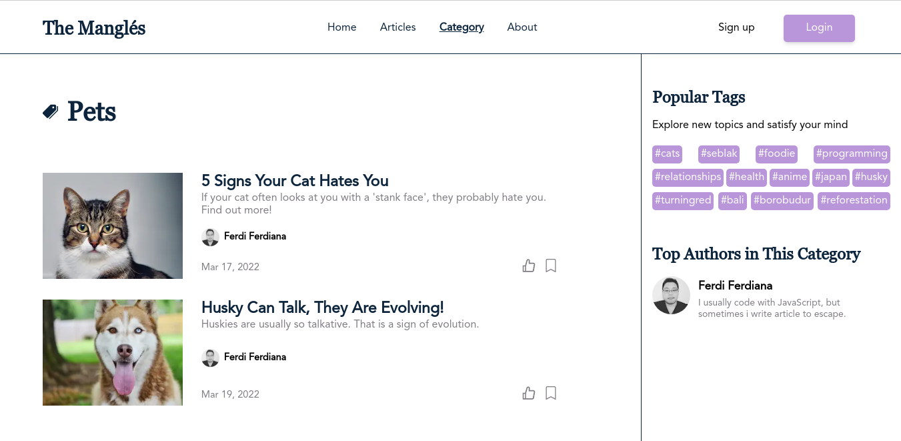

<div id="top"></div>

<!-- PROJECT LOGO -->
<br />
<div align="center">
  <a href="https://github.com/ferdianfh/the-mangles">
    
  </a>

  <h3 align="center">The Mangl&eacute;s</h3>

  <p align="center">
    Share Information and Educate People.
    <br />
    <a href="https://github.com/ferdianfh/the-mangles"><strong>Explore the docs »</strong></a>
    <br />
    <br />
    <a href="https://github.com/ferdianfh/the-mangles">View Demo</a>
    ·
    <a href="https://github.com/ferdianfh/the-mangles/issues">Report Bug</a>
    ·
    <a href="https://github.com/ferdianfh/the-mangles/issues">Request Feature</a>
  </p>
</div>

<!-- ABOUT THE PROJECT -->

## About The Project


**The Mangles** is A Website Based Application for Reading, Writing, and Publishing either News or Articles to help people expressing their thoughts, imagination, and ideas.

<p align="right">(<a href="#top">back to top</a>)</p>

### Built With

This app was built with some technologies

- [NextJS](https://reactjs.org/)
- [Axios](https://axios-http.com/)
- [Tailwind CSS](https://getbootstrap.com)
- [Vercel](https://www.netlify.com/)
- [Backend APIs](https://github.com/ferdianfh/RESTful-API-with-ExpressJS)

<p align="right">(<a href="#top">back to top</a>)</p>

## Getting Started

### Prerequisites

- npm
  ```sh
  npm install npm@latest -g
  ```

### Installation

1. Clone the repo
   ```sh
   git clone https://github.com/ferdianfh/the-mangles.git
   ```
2. Install NPM packages
   ```sh
   npm install
   ```
3. Start the Application
   ```sh
   npm start
   ```

## Demonstration

Or you can try it here: [Zwallet Web App](https://themangles.vercel.app)

## Snippets

Here are some snippets about this app:

> Web page

|                      Landing Page                       |   Landing Page Mobile    |
| :-----------------------------------------------------: | :----------------------: |
|  |                     |
|                    Registration Page                    | Registration Page Mobile |
|   |                     |
|                        Home Page                        |     Home Page Mobile     |
|           |                     |
|                       Editor Page                       |    Editor Page Mobile    |
|         |                     |
|                      Articles Page                      |   Articles Page Mobile   |
|     |                     |
|                      Category Page                      |   Category Page Mobile   |
|     |                     |

<p align="right">(<a href="#top">back to top</a>)</p>

## The Mangles Update!

**The Mangl&eacute;s** is currently on development process!

<p align="right">(<a href="#top">back to top</a>)</p>

<!-- CONTACT -->

## Contact

Ferdi Ferdiana - [Linkedin](https://www.linkedin.com/in/ferdianfh/) - ferdifh82@gmail.com

<p align="right">(<a href="#top">back to top</a>)</p>
